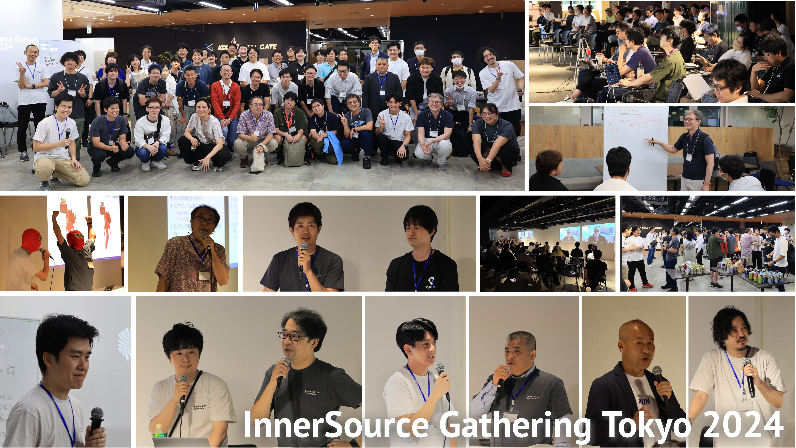

[[JAPANESE REPORT IS AVAILABLE HERE]](/tokyo-2024/report)

## InnerSource Gathering Tokyo 2024 Event Report

 
The InnerSource Gathering Tokyo 2024 concluded successfully. Over 70 people gathered at the venue, making it a wonderful event showcasing the growth and enthusiasm of the InnerSource community in Japan.

 

### Acknowledgements

This event's success would not have been possible without the support of many people:

- All participants
- Speakers who gave excellent presentations
- Sponsors who provided the venue and support (The Linux Foundation, Nifty Corporation, KDDI Agile Development Center Corporation)
- Everyone involved in the community on a regular basis

When we first launched this community, the term "InnerSource" was hardly known in Japan. Now, many people are interested in this concept and have begun implementing it. Thanks to all of you, we were able to further spread the concept and practice of InnerSource in Japan. We sincerely thank you.

If you're interested in the InnerSource community, please join us through the link below. We share the latest information on InnerSource and exchange information about community activities.

**👉 [Link to InnerSource Commons Slack](https://innersourcecommons.org/slack) [(You can converse in Japanese in the #japan channel)](https://innersourcecommons.slack.com/archives/C03M546NR16)**

We look forward to continuing to walk together towards the development of the InnerSource community. Let's meet again at the next event!

 
Yuki Hattori - Vice President of the InnerSource Commons Foundation
 

## Sessions

Many people participated and there were many excellent sessions. Below is a list of the sessions. Links to session videos and slides are also provided, so please check them out.

| Session | Speaker | Video | Resources |
|---------|---------|-------|-----------|
| [OPENING](#opening) | The InnerSource Commons Foundation | [Video](https://youtu.be/kkxRvNP31K8) | |
| [Welcome to the InnerSource Gathering](#welcome-to-the-innersource-gathering) | Danese Cooper, Daniel Izquierdo Cortázar | [Video](https://youtu.be/484zxLjDlCo) | |
| [Keynote: Building Organizations that Leverage Feedback, Learning from World-Class Engineers' Thinking](#keynote-building-organizations-that-leverage-feedback-learning-from-world-class-engineers-thinking) | Takeshi Ushio, Yuki Hattori | [Video](https://youtu.be/So8HGrgBGDE) | |
| [Special Session: Break Down Silos with InnerSource x Team Topologies!](#special-session-break-down-silos-with-innersource-x-team-topologies) | Ryutaro Yoshiba, Junya Miyake | [Video](https://youtu.be/MjiP7GMpu7Q) | [PDF](innersource-teamtopologies.pdf) |
| [Starting InnerSource from Scratch with a Bottom-Up Approach](#starting-innersource-from-scratch-with-a-bottom-up-approach) | Hajime Komatsu | [Video](https://youtu.be/3eWYIgCI8FI) | [Speaker Deck](https://speakerdeck.com/niftycorp/innersource-gathering-tokyo-2024-komatsu) |
| [Sony Group Open Source Activities and Group Collaboration](#sony-group-open-source-activities-and-group-collaboration) | Kazumi Sato | [Video](https://youtu.be/Xv2y0a-CShU) | [PDF](sony-group-opensource-activities-group-collaboration.pdf) |
| [Collaborative Project Management](#collaborative-project-management) | Noriaki Fukuyasu | [Video](https://youtu.be/he7bAdxJCNw) | [PDF](collaborative-project-management.pdf) |
| [Fun Project: InnerSource Man of the Co-Creative Future!](#fun-project-innersource-man-of-the-co-creative-future) | Tomohiro Nakajima, InnerSource Man | [Video](https://youtu.be/ynlGpNnTCkc) | [Speaker Deck](https://speakerdeck.com/piyonakajima/reflesh-the-fun-project-innersource-gathering-tokyo-2024) [MP3](https://github.com/kddi-agile/FunDoneLearnNoUta)|
| [GREE's 20th Anniversary! InnerSource Behind a Product that Lasted 20 Years](#grees-20th-anniversary-innersource-behind-a-product-that-lasted-20-years) | Kiyokazu Hayashi (Kiyo) | [Video](https://youtu.be/fAW8jQpUg78) | [PDF](gree-presentation.pdf) |
| [CyberAgent's InnerSourcing Initiatives](#cyberagents-innersourcing-initiatives) | Kenta Kozuka, Taku Maeda | [Video](https://youtu.be/kX7Mp8OF9Ew) | [Speaker Deck](https://speakerdeck.com/cyberagentdevelopers/cyberagent-inner-sourcing) |
 
 

### OPENING

 

<iframe width="560" height="315" src="https://www.youtube.com/embed/kkxRvNP31K8?si=uMyGKM07XP1AREdS" title="YouTube video player" frameborder="0" allow="accelerometer; autoplay; clipboard-write; encrypted-media; gyroscope; picture-in-picture; web-share" referrerpolicy="strict-origin-when-cross-origin" allowfullscreen></iframe>

 
 

## Welcome to the InnerSource Gathering

**Danese Cooper, Founder of the InnerSource Commons Foundation**
 
**Daniel Izquierdo Cortázar, President of the InnerSource Commons Foundation**

 

<iframe width="560" height="315" src="https://www.youtube.com/embed/484zxLjDlCo?si=_vG0bzu37VW39Qw3" title="YouTube video player" frameborder="0" allow="accelerometer; autoplay; clipboard-write; encrypted-media; gyroscope; picture-in-picture; web-share" referrerpolicy="strict-origin-when-cross-origin" allowfullscreen></iframe>

 
 

### Keynote: Building an Organization that Leverages Feedback, Learning from World-Class Engineers' Thinking

**Tsuyoshi Ushio (Sr. Software Engineer at Microsoft)**  
**Yuki Hattori (Vice President of the InnerSource Commons Foundation / Sr. Architect at GitHub)**

We will delve deeper into the theme of "welcoming feedback" introduced in Ushio-san's book "Thinking Methods of World-Class Engineers". We will gain insights into mental models and team building from Ushio-san's experiences on how to promote feedback and generate constructive dialogue in organizations. Together with Hattori-san, VP of InnerSource Commons, we will explore the cultivation of organizational culture through feedback.

 

<iframe width="560" height="315" src="https://www.youtube.com/embed/So8HGrgBGDE?si=pcBUGR-3jSdYnfV_" title="YouTube video player" frameborder="0" allow="accelerometer; autoplay; clipboard-write; encrypted-media; gyroscope; picture-in-picture; web-share" referrerpolicy="strict-origin-when-cross-origin" allowfullscreen></iframe>

[Video](https://youtu.be/So8HGrgBGDE)
 
 

### Special Session: Breaking Down Silos with InnerSource x Team Topologies

**Ryutaro Yoshiba (Founder and CTO of Attractor Inc)**  
**Junya Miyake (KDDI Agile Development Center Corporation)**

In this session, we will delve into the theme of "Team Topologies x InnerSource" through a dialogue between Yoshiba-san and Miyake. Breaking down silos is not simply about "increasing interaction time between teams!", but about appropriate responsibilities and states between teams. We will explore together with you "How can we break down silos and realize more and faster value flow as an organization from the perspectives of InnerSource and Team Topologies?"

 

<iframe width="560" height="315" src="https://www.youtube.com/embed/MjiP7GMpu7Q?si=gMPx7UAK6a1dM3j3" title="YouTube video player" frameborder="0" allow="accelerometer; autoplay; clipboard-write; encrypted-media; gyroscope; picture-in-picture; web-share" referrerpolicy="strict-origin-when-cross-origin" allowfullscreen></iframe>

[Video](https://youtu.be/MjiP7GMpu7Q) | [PDF](innersource-teamtopologies.pdf) 
 
 

### Starting InnerSource from Scratch with a Bottom-Up Approach

**Hajime Komatsu (Nifty Corporation)**

Nifty has been promoting InnerSource adoption from scratch with a bottom-up approach. Although we are still halfway there, the term "InnerSource" is gradually permeating within the company, and collaborations are slowly emerging. In this session, we will share real-life examples of the specific steps we actually took for implementation, the hurdles we faced, and the current challenges we are dealing with. We hope this will provide hints for those who are considering trying InnerSource.

 

<iframe width="560" height="315" src="https://www.youtube.com/embed/3eWYIgCI8FI?si=xpz1VGe2jOdC7U-x" title="YouTube video player" frameborder="0" allow="accelerometer; autoplay; clipboard-write; encrypted-media; gyroscope; picture-in-picture; web-share" referrerpolicy="strict-origin-when-cross-origin" allowfullscreen></iframe>

[Video](https://youtu.be/3eWYIgCI8FI) | [Speaker Deck](https://speakerdeck.com/niftycorp/innersource-gathering-tokyo-2024-komatsu)
 
 

### Sony Group Open Source Activities and Group Collaboration

**Kazumi Sato (Distinguished Engineer at Sony Group Corporation)**

Sony has been utilizing open source, including Linux, in its products since 2002. This presentation will introduce Sony's internal technical collaboration system, open source promotion system, and open source development along with its background.

 

<iframe width="560" height="315" src="https://www.youtube.com/embed/Xv2y0a-CShU?si=-FV4eDPHgYUrWJQI" title="YouTube video player" frameborder="0" allow="accelerometer; autoplay; clipboard-write; encrypted-media; gyroscope; picture-in-picture; web-share" referrerpolicy="strict-origin-when-cross-origin" allowfullscreen></iframe>

[Video](https://youtu.be/Xv2y0a-CShU) | [PDF](sony-group-opensource-activities-group-collaboration.pdf)
 
 

### Collaborative Project Management

**Noriaki Fukuyasu (Japan Representative, The Linux Foundation)**

Open source and InnerSource have a major commonality. That is, they involve collaborative work (collaborative projects) on common significance among stakeholders across organizations that strictly have different goals. What is needed to successfully launch these collaborative projects and continue to provide value to the organization? Collaborative projects involve investment. To find common significance across different organizations and make investment decisions as a company, numbers and mechanisms are necessary.

In this session, based on the author's experience in managing open source projects at the Linux Foundation, we will introduce key points for creating value through cross-organizational collaboration where stakeholders from different organizations find significance, presenting specific examples and methods.

 

<iframe width="560" height="315" src="https://www.youtube.com/embed/he7bAdxJCNw?si=7nzgGneR9GGGkDt2" title="YouTube video player" frameborder="0" allow="accelerometer; autoplay; clipboard-write; encrypted-media; gyroscope; picture-in-picture; web-share" referrerpolicy="strict-origin-when-cross-origin" allowfullscreen></iframe>

[Video](https://youtu.be/he7bAdxJCNw) | [PDF](collaborative-project-management.pdf)

 
 

### Fun Project "Co-creation Future InnerSource Man!"

**Tomohiro Nakajima (KDDI Agile Development Center Corporation)** 

**InnerSource Man**

 

<iframe width="560" height="315" src="https://www.youtube.com/embed/ynlGpNnTCkc?si=O_X5JA4bHiZ9hFRM" title="YouTube video player" frameborder="0" allow="accelerometer; autoplay; clipboard-write; encrypted-media; gyroscope; picture-in-picture; web-share" referrerpolicy="strict-origin-when-cross-origin" allowfullscreen></iframe>

[Video](https://youtu.be/ynlGpNnTCkc) | [Speaker Deck](https://speakerdeck.com/piyonakajima/reflesh-the-fun-project-innersource-gathering-tokyo-2024) | [MP3](https://github.com/kddi-agile/FunDoneLearnNoUta)
 
 

### GREE's 20th Anniversary! The InnerSource Behind a Product That Has Lasted 20 Years

**Kiyo (Lead Engineer, Development Division, GREE, Inc.)**

GREE's 20th Anniversary! We'll introduce the InnerSource culture and development operations behind a product that has lasted 20 years! InnerSource existed properly even 20 years ago!

 

<iframe width="560" height="315" src="https://www.youtube.com/embed/fAW8jQpUg78?si=2jxfu_1oJN59qod1" title="YouTube video player" frameborder="0" allow="accelerometer; autoplay; clipboard-write; encrypted-media; gyroscope; picture-in-picture; web-share" referrerpolicy="strict-origin-when-cross-origin" allowfullscreen></iframe>

[Video](https://youtu.be/fAW8jQpUg78) | [PDF](gree-presentation.pdf)
 
 

### InnerSourcing Initiatives at CyberAgent

**Kenta Kozuka (Head of Developer Productivity Office)**  
**Taku Maeda (Technical Manager for ABEMA Live/CyberFight/FANBASE ARENA (concurrent positions))**

At CyberAgent, we support the promotion of company-wide use of products developed in business and collaboration in development to utilize internal technical assets. In this session, we will introduce the "D-grade" initiative, which is a company-wide project, and explain the background of the development of PipeCD and terraform-provider-pipecd projects, which are examples of InnerSourcing, and their actual operation methods.

 

<iframe width="560" height="315" src="https://www.youtube.com/embed/kX7Mp8OF9Ew?si=1FdG0G_4KNOzNfHm" title="YouTube video player" frameborder="0" allow="accelerometer; autoplay; clipboard-write; encrypted-media; gyroscope; picture-in-picture; web-share" referrerpolicy="strict-origin-when-cross-origin" allowfullscreen></iframe>

[Video](https://youtu.be/kX7Mp8OF9Ew) | [Speaker Deck](https://speakerdeck.com/cyberagentdevelopers/cyberagent-inner-sourcing)
 

## Organizers Wanted!

This event is organized by a volunteer group of organizers.
We are recruiting organizers for the next event. If you are interested, please feel free to reach out!
Let's liven up the community together!
We are waiting for you in the <code>#japan</code> channel on [InnerSource Commons Slack](https://innersourcecommons.org/slack).

