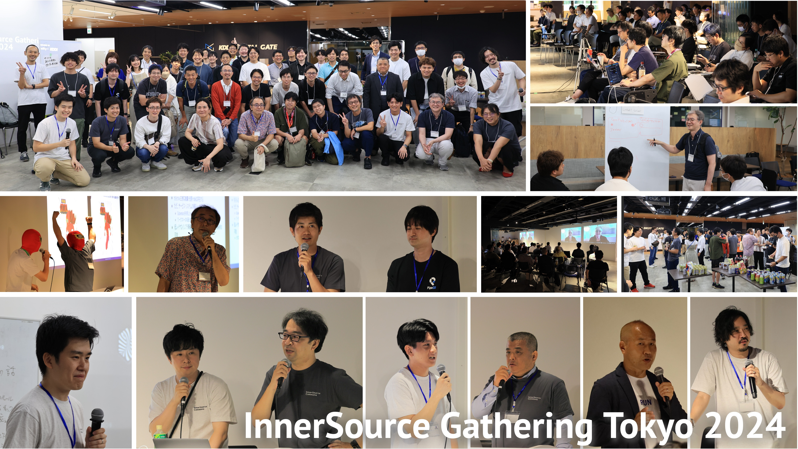
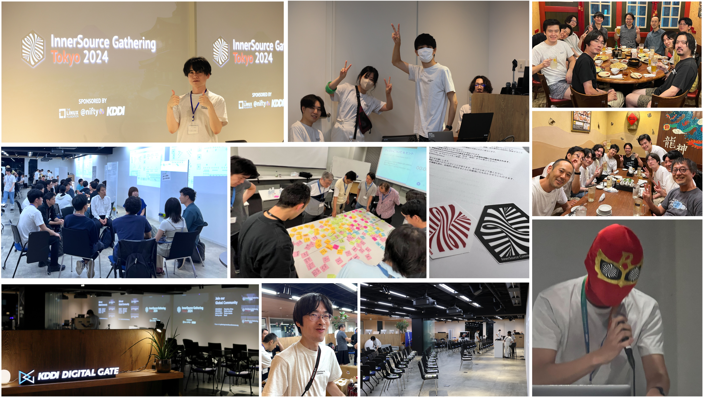

[[ENGLISH REPORT IS AVAILABLE HERE]](/tokyo-2024/report-isgt2024)

## InnerSource Gathering Tokyo 2024 イベントレポート

 

InnerSource Gathering Tokyo 2024は盛況のうちに終了しました。当日は約70名を超える方が会場に集い、日本におけるInnerSourceコミュニティの成長と熱意を示す素晴らしいイベントとなりました。

 

### 謝辞

本イベントの成功は、多くの方々のサポートなしには実現できませんでした。

- すべての参加者の皆様
- 素晴らしい講演を行ってくださった登壇者の皆様
- 会場提供とサポートをいただいたスポンサーの皆様（The Linux Foundation, フティ株式会社, KDDIアジャイル開発センター株式会社 の皆様）
- そして、日頃からコミュニティに関わってくださるすべての皆様

InnerSource Gathering Tokyo 2024 運営チームを代表してお礼申し上げます。

このコミュニティを立ち上げた当初、日本では「InnerSource（インナーソース）」という言葉はほとんど知られていませんでしたが、しかし今では多くの方々がこの概念に興味を持ち、実践を始めています。
皆様のおかげで、InnerSourceの概念と実践を日本でさらに広げることができました。心より感謝申し上げます。
 
インナーソースコミュニティにご興味がある方は、ぜひ以下のリンクからコミュニティに参加してください。
インナーソースの最新情報や、コミュニティの活動についての情報交換を行っています。

**👉&nbsp;[InnerSource Commons Slack のリンクはこちら](https://innersourcecommons.org/slack) [(<code>#japan</code>チャネルでは日本語で会話できます)](https://innersourcecommons.slack.com/archives/C03M546NR16)**

これからも、InnerSourceコミュニティの発展に向けて、共に歩んでいけることを楽しみにしています。次回のイベントでまたお会いしましょう！
 
 
服部 佑樹 - Vice President of the InnerSource Commons Foundation
 
 

## セッション

多くの方々が参加してくださり、多くの素晴らしいセッションが行われました。以下にセッションのリストを掲載しています。セッションの動画やスライドへのリンクも掲載していますので、ぜひご覧ください。

| セッション | 登壇者 | 動画　 | リソース |
|------------|--------|------|----------|
| [OPENING](#opening) | The InnerSource Commons Foundation　 | [動画](https://youtu.be/kkxRvNP31K8) | |
| [Welcome to the InnerSource Gathering](#welcome-to-the-innersource-gathering) | Danese Cooper, Daniel Izquierdo Cortázar　 | [動画](https://youtu.be/484zxLjDlCo) | |
| [基調講演: 世界一流エンジニアの思考法から学ぶ、フィードバックを活かす組織づくり](#基調講演世界一流エンジニアの思考法から学ぶフィードバックを活かす組織づくり)　 | 牛尾 剛, 服部 佑樹 | [動画](https://youtu.be/So8HGrgBGDE) | |
| [インナーソース×チームトポロジーでサイロをぶっ壊せ！](#スペシャルセッションインナーソースチームトポロジーでサイロをぶっ壊せ) | 吉羽 龍太郎, 三宅 潤也 | [動画](https://youtu.be/MjiP7GMpu7Q) | [PDF](innersource-teamtopologies.pdf) |
| [ゼロからボトムアップで始めるインナーソース](#ゼロからボトムアップで始めるインナーソース) | 小松 初 | [動画](https://youtu.be/3eWYIgCI8FI) | [Speaker Deck](https://speakerdeck.com/niftycorp/innersource-gathering-tokyo-2024-komatsu) |
| [Sony Group Open Source Activities and Group Collaboration](#sony-group-open-source-activities-and-group-collaboration) | 佐藤 和美 | [動画](https://youtu.be/Xv2y0a-CShU) | [PDF](sony-group-opensource-activities-group-collaboration.pdf) |
| [コラボラティブ・プロジェクト管理](#コラボラティブプロジェクト管理) | 福安 徳晃 | [動画](https://youtu.be/he7bAdxJCNw) | [PDF](collaborative-project-management.pdf) |
| [共創未来　インナーソースマン！](#お楽しみ企画共創未来インナーソースマン) | 中島 智弘, インナーソースマン　 | [動画](https://youtu.be/ynlGpNnTCkc) | [Speaker Deck](https://speakerdeck.com/piyonakajima/reflesh-the-fun-project-innersource-gathering-tokyo-2024)　[MP3](https://github.com/kddi-agile/FunDoneLearnNoUta)|
| [GREE 20周年! 20年続いたプロダクトの裏にあるInnerSource](#gree-20周年-20年続いたプロダクトの裏にあるinnersource) | 林 記代一 (Kiyo) | [動画](https://youtu.be/fAW8jQpUg78) | [PDF](gree-presentation.pdf) |
| [サイバーエージェントにおけるインナーソーシングの取り組み](#サイバーエージェントにおけるインナーソーシングの取り組み) | 小塚健太, 前田 拓 | [動画](https://youtu.be/kX7Mp8OF9Ew) | [Speaker Deck](https://speakerdeck.com/cyberagentdevelopers/cyberagent-inner-sourcing) |

 
 

### OPENING

 

<iframe width="560" height="315" src="https://www.youtube.com/embed/kkxRvNP31K8?si=uMyGKM07XP1AREdS" title="YouTube video player" frameborder="0" allow="accelerometer; autoplay; clipboard-write; encrypted-media; gyroscope; picture-in-picture; web-share" referrerpolicy="strict-origin-when-cross-origin" allowfullscreen></iframe>

 
 

### Welcome to the InnerSource Gathering

**Danese Cooper, Founder of the InnerSource Commons Foundation**  
**Daniel Izquierdo Cortázar, President of the InnerSource Commons Foundation**

 

<iframe width="560" height="315" src="https://www.youtube.com/embed/484zxLjDlCo?si=_vG0bzu37VW39Qw3" title="YouTube video player" frameborder="0" allow="accelerometer; autoplay; clipboard-write; encrypted-media; gyroscope; picture-in-picture; web-share" referrerpolicy="strict-origin-when-cross-origin" allowfullscreen></iframe>

 
 

### 基調講演：世界一流エンジニアの思考法から学ぶ、フィードバックを活かす組織づくり

**牛尾 剛 (Sr. Software Engineer at Microsoft)**  
**服部 佑樹(Vice President of the InnerSource Commons Foundation / Sr. Architect at GitHub)**

牛尾さんの著書「世界一流エンジニアの思考法」で紹介された「フィードバックを歓迎する」というテーマを深掘りします。組織においてどのようにフィードバックを促進し、建設的な対話を生み出すかについて、牛尾さんの経験から、メンタルモデルやチームビルディングに対するヒントを得ていきます。InnerSource Commons VPの服部氏とともに、フィードバックを通じた組織文化の醸成について掘り下げます。

 

<iframe width="560" height="315" src="https://www.youtube.com/embed/So8HGrgBGDE?si=pcBUGR-3jSdYnfV_" title="YouTube video player" frameborder="0" allow="accelerometer; autoplay; clipboard-write; encrypted-media; gyroscope; picture-in-picture; web-share" referrerpolicy="strict-origin-when-cross-origin" allowfullscreen></iframe>

[動画](https://youtu.be/So8HGrgBGDE)
 
 

### スペシャルセッション：インナーソース×チームトポロジーでサイロをぶっ壊せ

**吉羽 龍太郎 (株式会社アトラクタ Founder兼CTO)**

**三宅 潤也(KDDIアジャイル開発センター株式会社)**

このセッションでは吉羽さんと三宅の対話形式で「チームトポロジーxインナーソースをテーマ」に掘り下げていきます。サイロ解消は単に「チーム間の交流の時間を増やそう！」のような単純な話ではなく、適切な責務とチーム間の状態が大切です。そこで「インナーソース、チームトポロジーそれぞれの観点からサイロを壊して組織としてより速く多くの価値フローを実現するには？」をみなさんと一緒に考えていきます。

 

<iframe width="560" height="315" src="https://www.youtube.com/embed/MjiP7GMpu7Q?si=gMPx7UAK6a1dM3j3" title="YouTube video player" frameborder="0" allow="accelerometer; autoplay; clipboard-write; encrypted-media; gyroscope; picture-in-picture; web-share" referrerpolicy="strict-origin-when-cross-origin" allowfullscreen></iframe>

[動画](https://youtu.be/MjiP7GMpu7Q) | [PDF](innersource-teamtopologies.pdf)
 
 

### ゼロからボトムアップで始めるインナーソース

**小松 初 (ニフティ株式会社 システム統括部 基幹システムグループ)**

ニフティはゼロからボトムアップでインナーソース導入を進めてきました。まだ道半ばではありますが、「インナーソース」というワードが社内でも徐々に浸透し、少しずつコラボレーションが生まれています。本セッションでは、導入のために実際に行った具体的なステップや直面したハードル、現在抱える悩みなどリアルな事例として共有します。これからインナーソースを試してみたいと考えている方々にとって、ヒントになれば幸いです。

 

<iframe width="560" height="315" src="https://www.youtube.com/embed/3eWYIgCI8FI?si=xpz1VGe2jOdC7U-x" title="YouTube video player" frameborder="0" allow="accelerometer; autoplay; clipboard-write; encrypted-media; gyroscope; picture-in-picture; web-share" referrerpolicy="strict-origin-when-cross-origin" allowfullscreen></iframe>

[動画](https://youtu.be/3eWYIgCI8FI) | [Speaker Deck](https://speakerdeck.com/niftycorp/innersource-gathering-tokyo-2024-komatsu)
 
 

### Sony Group Open Source Activities and Group Collaboration

**佐藤 和美 (Distinguished Engineer at ソニーグループ株式会社)**

ソニーでは2002年より製品でLinuxをはじめとするオープンソースを活用している。この講演ではソニーにおける社内技術コラボレーション体制、オープンソース推進体制、そしてオープンソース開発とその背景について紹介する。

 

<iframe width="560" height="315" src="https://www.youtube.com/embed/Xv2y0a-CShU?si=-FV4eDPHgYUrWJQI" title="YouTube video player" frameborder="0" allow="accelerometer; autoplay; clipboard-write; encrypted-media; gyroscope; picture-in-picture; web-share" referrerpolicy="strict-origin-when-cross-origin" allowfullscreen></iframe>

[動画](https://youtu.be/Xv2y0a-CShU) | [PDF](sony-group-opensource-activities-group-collaboration.pdf)
 
 

### コラボラティブ・プロジェクト管理

**福安 徳晃 (The Linux Foundation 日本代表)**

オープンソースとインナーソースには大きな共通点があります。それは厳密にはゴールを異にする組織を隔てた関係者間で、共通の意義を見出し、その点において共同作業 (collaborative project = コラボラティブ・プロジェクト）をする点です。このコラボラティブ・プロジェクトを成功裡に立ち上げ、継続して組織に価値を提供していくには何が必要か？コラボラティブ・プロジェクトには投資が伴います。異なる組織感で共通の意義を見出し、企業として投資判断するためには、数値や仕組みが必要となります。

本セッションでは、筆者がこれまでLinux Foundationでのオープンソースプロジェクト管理に携わった経験から、組織が異なるステークホルダーが意義を見出し、組織間コラボレーションを通して価値を創出する上でのキーポイントを具体的実例や手法などを提示しつつ紹介します。

 

<iframe width="560" height="315" src="https://www.youtube.com/embed/he7bAdxJCNw?si=7nzgGneR9GGGkDt2" title="YouTube video player" frameborder="0" allow="accelerometer; autoplay; clipboard-write; encrypted-media; gyroscope; picture-in-picture; web-share" referrerpolicy="strict-origin-when-cross-origin" allowfullscreen></iframe>

[動画](https://youtu.be/he7bAdxJCNw) | [PDF](collaborative-project-management.pdf)

 
 

### お楽しみ企画「共創未来インナーソースマン！」

**中島 智弘 (KDDIアジャイル開発センター株式会社)**

**インナーソースマン**

 

<iframe width="560" height="315" src="https://www.youtube.com/embed/ynlGpNnTCkc?si=O_X5JA4bHiZ9hFRM" title="YouTube video player" frameborder="0" allow="accelerometer; autoplay; clipboard-write; encrypted-media; gyroscope; picture-in-picture; web-share" referrerpolicy="strict-origin-when-cross-origin" allowfullscreen></iframe>

[動画](https://youtu.be/ynlGpNnTCkc) | [Speaker Deck](https://speakerdeck.com/piyonakajima/reflesh-the-fun-project-innersource-gathering-tokyo-2024) | [MP3](https://github.com/kddi-agile/FunDoneLearnNoUta)
 
 

### GREE 20周年! 20年続いたプロダクトの裏にあるInnerSource

**林 記代一 (Kiyo) (グリー株式会社開発本部 Lead Engineer)**

GREE 20周年! 20年続いたプロダクトの裏にあるInnerSourceな文化や開発運用をご紹介します！20年前でもちゃんとInnerSourceはありました！

 

<iframe width="560" height="315" src="https://www.youtube.com/embed/fAW8jQpUg78?si=2jxfu_1oJN59qod1" title="YouTube video player" frameborder="0" allow="accelerometer; autoplay; clipboard-write; encrypted-media; gyroscope; picture-in-picture; web-share" referrerpolicy="strict-origin-when-cross-origin" allowfullscreen></iframe>

[動画](https://youtu.be/fAW8jQpUg78) | [PDF](gree-presentation.pdf)
 
 

### サイバーエージェントにおけるインナーソーシングの取り組み

**小塚健太 (Developer Productivity室 室長)**  
**前田 拓 (ABEMA Live/CyberFight/FANBASE ARENA 技術責任者(各兼務))**

サイバーエージェントでは社内の技術資産活用のために業務で開発したプロダクトの全社利用の促進とコラボレーションでの開発を支援してます。本セッションでは全社プロジェクトではある「Dグレード」の取り組みの紹介と、インナーソーシングの一例であるPipeCDとterraform-provider-pipecdというプロジェクトが開発に至った経緯と実際の運用方法について説明します。

 

<iframe width="560" height="315" src="https://www.youtube.com/embed/kX7Mp8OF9Ew?si=1FdG0G_4KNOzNfHm" title="YouTube video player" frameborder="0" allow="accelerometer; autoplay; clipboard-write; encrypted-media; gyroscope; picture-in-picture; web-share" referrerpolicy="strict-origin-when-cross-origin" allowfullscreen></iframe>

[動画](https://youtu.be/kX7Mp8OF9Ew) | [Speaker Deck](https://speakerdeck.com/cyberagentdevelopers/cyberagent-inner-sourcing)
 

## オーガナイザー募集中

このイベントの開催には有志で構成されるオーガナイザーグループで運営が行われています。
次回のイベントに向けて、オーガナイザーを募集しています。興味がある方は、ぜひお気軽にお声がけください！
一緒にコミュニティを盛り上げていきましょう！
[InnerSource Commons Slack](https://innersourcecommons.org/slack) の<code>#japan</code>チャネルでお待ちしています。

